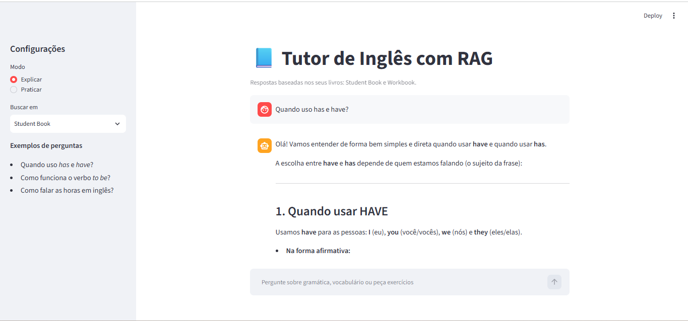
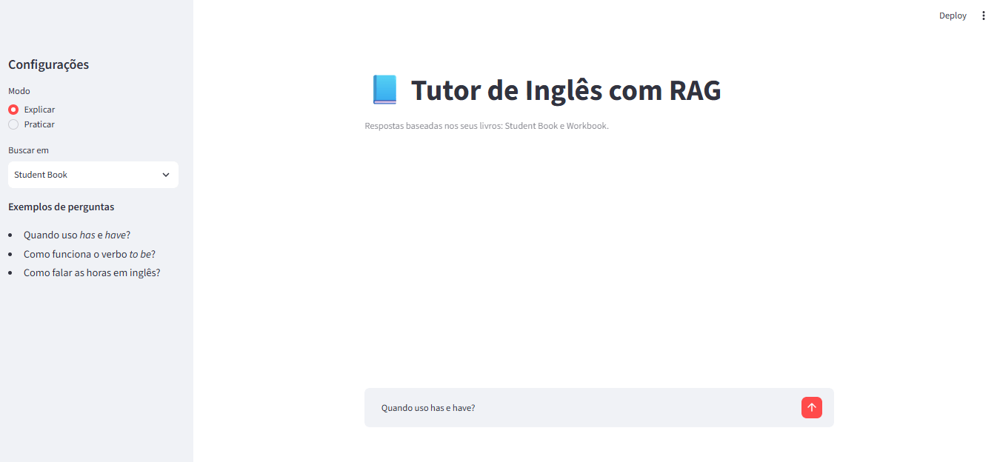

# 📘 Tutor de Inglês com RAG

Chat que responde dúvidas e gera exercícios de inglês **com base nos livros do próprio aluno** (Student Book e Workbook), usando uma pipeline de Retrieval-Augmented Generation.

> ⚠️ Os livros são protegidos por direitos autorais e **não estão neste repositório**. Coloque seus próprios PDFs na pasta `books/`.

## Arquitetura

| Módulo | Responsabilidade |
|---|---|
| `config.py` | Caminhos, modelos e parâmetros em um só lugar |
| `llms.py` | Fábrica de modelos: troca Gemini (gratuito) e OpenAI mudando uma variável
| `ingest.py` | PDF → texto por página (visão para páginas escaneadas) → chunks → embeddings → FAISS |
| `rag.py` | Busca semântica com filtro por livro → re-rank → resposta do tutor |
| `app.py` | Interface Streamlit (modos Explicar/Praticar, fontes visíveis) |

Fluxo: `PDF → transcrição → chunking (overlap + metadados) → embeddings → FAISS → busca → re-rank → LLM → resposta com fontes`

## Decisões técnicas

- **Livros escaneados**: a maioria das páginas é imagem. Elas são transcritas com um modelo de visão e guardadas em cache, então cada página é paga uma única vez.
- **Metadados** (`book`, `page`): permitem filtrar por livro e citar a página na resposta.
- **Re-rank em uma chamada**: o LLM reordena os 8 candidatos e escolhe os 4 melhores.
- **Dois modos**: explicar um tema ou praticar com exercícios.

## Como rodar

### Pré-requisitos

- Python **3.10 ou superior** (confira com `python --version`)
- Uma chave gratuita do Gemini, gerada no [Google AI Studio](https://aistudio.google.com/)

## 1. Crie o ambiente e instale as dependências

### Escolha **uma** das duas opções.

#### Opção A: venv (você já tem Python 3.10+)

**Windows (PowerShell ou terminal do VS Code)**

```powershell
python -m venv .venv
.venv\Scripts\Activate.ps1
pip install -r requirements.txt
```

> Se o PowerShell bloquear a ativação, rode `Set-ExecutionPolicy -Scope Process RemoteSigned` e tente de novo.

**Windows (Prompt de Comando / CMD)**

```bat
python -m venv .venv
.venv\Scripts\activate.bat
pip install -r requirements.txt
```

**Linux / macOS**

```bash
python3 -m venv .venv
source .venv/bin/activate
pip install -r requirements.txt
```

Quando o ambiente estiver ativo, o terminal mostra `(.venv)` no início da linha.

#### Opção B: Conda (Anaconda ou Miniconda)

Útil se o seu Python for anterior à versão 3.10.

```bash
conda create -n tutor python=3.11 -y
conda activate tutor
pip install -r requirements.txt
```

- Com o conda, você **não usa** `python -m venv`. Sempre que abrir um terminal novo, rode `conda activate tutor` antes de qualquer comando do projeto.
- No VS Code, pressione `Ctrl+Shift+P`, digite **Python: Select Interpreter** e escolha o ambiente `tutor`. Assim o editor também usa o Python certo.

#### Crie e configure o arquivo `.env` (nas duas opções)

```powershell
copy .env.example .env      # Windows
```

```bash
cp .env.example .env        # Linux / macOS
```
## 2. Configure a chave

Abra o arquivo `.env` (criado no passo anterior) e cole sua chave do Gemini:

```
PROVIDER=gemini
GOOGLE_API_KEY=sua-chave-aqui
```

Sem aspas e sem espaços em volta do `=`. **Nunca** suba o `.env` para o GitHub (o `.gitignore` já o protege).

## 3. Adicione os livros

Coloque os arquivos PDF na pasta `books/`. Nomes terminando em `SB` e `WB` são reconhecidos como Student Book e Workbook.

## 4. Gere o índice

```bash
python ingest.py --limit 10   # teste rápido: só as 10 primeiras páginas de cada livro
python ingest.py              # índice completo (demora mais; pode ser retomado)
```

## 5. Abra o app

```bash
streamlit run app.py
```

O navegador abrirá automaticamente em `http://localhost:8501`.

## Demo

### A aplicação disponibiliza:

1- Pergunta em português e explicação detalhada baseada no livro (modo Explicar).

2- Trechos exatos usados na resposta, exibindo a fonte original (livro e número da página).

3- Modo Praticar, com suporte a filtros (ex: apenas Workbook), retornando exercícios e gabarito.

## Interface



## Demonstração 




## Plano gratuito do Gemini

- Gere a chave em Google AI Studio e coloque em GOOGLE_API_KEY.

- O plano gratuito tem limites por minuto e por dia. O projeto espera entre as chamadas e tenta de novo em caso de erro 429. Se o limite diário acabar, rode python ingest.py novamente no dia seguinte: o cache continua de onde parou.

- No plano gratuito, o Google pode usar o conteúdo enviado para melhorar seus modelos. Não envie documentos pessoais ou confidenciais.

- Se trocar de provedor, apague a pasta faiss_index/ e rode python ingest.py de novo (os vetores de cada provedor são incompatíveis).

## Próximos passos

- [ ] Avaliar a qualidade das respostas com um conjunto de perguntas de teste
- [ ] Trocar o re-rank por cross-encoder
- [ ] Exercícios com correção interativa


## 📩 Contato

 **Conecte-se comigo no LinkedIn:** 
 * [**Linkedin:**](https://www.linkedin.com/in/dayaneteodoro/) Dayane Teodoro

 * [**Portfólio:**](https://www.confeitariadayaneteodoro.com.br/) www.confeitariadayaneteodoro.com.br


"A tecnologia só faz sentido quando resolve um problema real." Se este projeto agregou valor, deixe uma ⭐ no repositório!

#python #rag #faiss #agente #streamlit #gemini-api #LangChain #backend